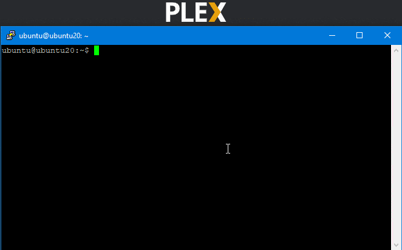

# plexargod
Plex Argo Daemon - A systemd script to update the Plex API to use the current cloudflared tunnel address for remote access

## Create a **free** Cloudflare Argo Tunnel to your Plex Media Server

Enables fast remote access to your Plex Media Server, even behind a carrier grade NAT or VPN with no port-forwarding ability.

**NOTE:** Do not add `localhost, 127.0.0.1, or ::1` to the `Settings/Network/List of IP addresses and networks that are allowed without auth` box. That will allow anyone with your Plex Argo URL (anyone that is a member of your server) to access the Admin WebUI with no access controls.

## What is CloudFlare Argo?

Read the [The Cloudflare Blog - A free Argo Tunnel for your next project](https://blog.cloudflare.com/a-free-argo-tunnel-for-your-next-project/).

TL;DR - **Free TryCloudFlare** Argo Tunnel features:
 - Operate much like a Reverse SSH tunnel + nginx on a remote VPS
 - A golang cross-platform tunneling daemon ([cloudflared](https://developers.cloudflare.com/argo-tunnel/downloads/))
 - Unique URLs per session (i.e. apple-bali-matters-local.trycloudflare.com)
 - Support for http:80 & https:443
 - Free to use and no bandwidth restrictions
 - No account or authentication requirements
 - Simplier setup with _much_ less overhead

## Remote Access Tunnel Setup

- Have your Plex Media Server running and contactable by the plexargod machine.
- Test Connectivity (401 Unauthorized is expected since we are not passing a Token)

  ```bash
  ubuntu@ubuntu20:~$ curl -s -I localhost:32400
  HTTP/1.1 401 Unauthorized
  X-Plex-Protocol: 1.0
  Content-Length: 193
  Content-Type: text/html
  Connection: close
  Cache-Control: no-cache
  Date: Thu, 16 Apr 2020 19:15:58 GMT
  ```

- Download and install [cloudflared](https://developers.cloudflare.com/argo-tunnel/downloads/) as a systemd service
    
  **NOTE:** If your Plex Media Server is not localhost to the cloudflared/plexargod process, change `localhost:32400` to `Plex_IP/Hostname:32400`
  
  ```bash
  sudo curl -O https://bin.equinox.io/c/VdrWdbjqyF/cloudflared-stable-linux-amd64.deb
  sudo apt-get install ./cloudflared-stable-linux-amd64.deb
  
  sudo cloudflared service install 2> /dev/null
  sudo bash -c "cat<<'EOF'>/etc/cloudflared/config.yml
  url: http://localhost:32400
  metrics: localhost:33400
  EOF"
  ```
- Install plexargod to `/usr/local/bin/` (or adjust the path everywhere else in this guide)
  ```bash
  sudo bash -c 'curl -s https://raw.githubusercontent.com/danielewood/plexargod/master/plexargod.sh > /usr/local/bin/plexargod'
  sudo chmod 755 /usr/local/bin/plexargod
  ```

- Run `/usr/local/bin/plexargod` to perform initial setup
  - Open browser signed in to your Plex Account to https://plex.tv/link
  - Enter the four digit code in the console

  

- Update `cloudflared.service` with hooks for plexargod:
  - Add these lines the `[Service]` section
  ```bash
  ExecStartPre=/usr/local/bin/cloudflared update
  ExecStartPost=/usr/local/bin/plexargod
  Environment=RUN_BY_SYSTEMD=1
  ```
  - Automated version of adding lines
  ```bash
  sudo bash -c "cat<<'EOF'>/etc/systemd/system/cloudflared.service
  [Unit]
  Description=Argo Tunnel
  After=network.target

  [Service]
  TimeoutStartSec=0
  Type=notify
  ExecStartPre=/usr/local/bin/cloudflared update
  ExecStart=/usr/local/bin/cloudflared --config /etc/cloudflared/config.yml --origincert /etc/cloudflared/cert.pem --no-autoupdate
  ExecStartPost=/usr/local/bin/plexargod
  Environment=RUN_BY_SYSTEMD=1
  Restart=on-failure
  RestartSec=5s

  [Install]
  WantedBy=multi-user.target
  EOF"
  
  sudo systemctl daemon-reload
  sudo systemctl restart cloudflared
  ```
- Done

## Plex API Endpoints

When you specify a custom connection URL in your Plex Media Server, it will publish that URL in the Plex API. This allows all your clients to discover alternative paths to your server. 

Plex API endpoints that are used to facilitate plexargod:
  - `https://plex.tv/pins.xml`
    - Requires `X-Plex-Client-Identifier` (Header)
    - `POST` returns Token URL and Code for 'https://plex.tv/link'
  - `https://plex.tv/pins/123456789`
    - Requires `X-Plex-Client-Identifier` (Header)
    - `GET` returns null or X-Plex-Token, depending on if user has entered code.
  - `${PlexServerURL}/:/prefs`
    - Requires `X-Plex-Token` (Header or Embedded in the URL)
    - `GET` to read the current preferences
    - `PUT` to change any of the preferences
  - `${PlexServerURL}/`
    - Requires `X-Plex-Token` (Header or Embedded in the URL)
    - `GET` to read the machineIdentifier that is used on plex.tv/api
  - `https://plex.tv/api/resources`
    - Requires `X-Plex-Token` (Header or Embedded in the URL)
    - `GET` to read the current published connections URLs

Once token is claimed, you will see it in your list of Authorized Devices.

